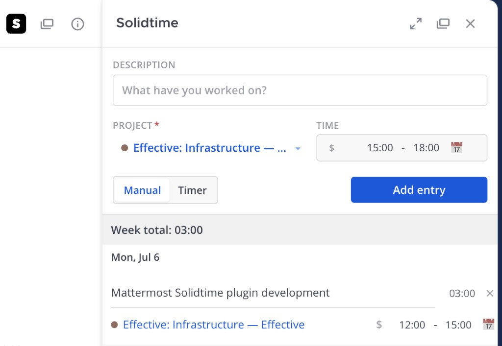
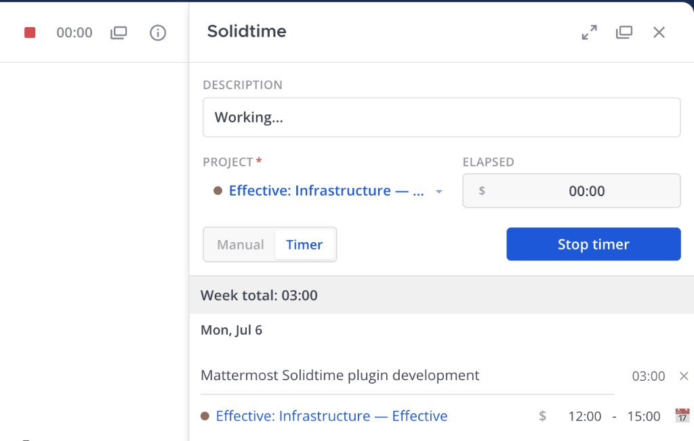

# Mattermost Solidtime Plugin

A Mattermost plugin for integrating with [Solidtime](https://www.solidtime.io/) — an open-source time tracker for freelancers and agencies. Track time, manage tasks and projects directly from the Mattermost interface.

<p align="center">
  
  &nbsp;&nbsp;
  
</p>

<p align="center">
  <em>Manual entry (left) and running timer (right) in the Mattermost right-hand sidebar.</em>
</p>

## Features

- **Plugin settings** — Solidtime server URL (self-hosted or cloud)
- **Slash command `/solidtime`** — connect and disconnect a user's account
- **Channel header button** — visible when the server URL is configured; quick access to the time tracker; when a timer is active — STOP widget + ticking elapsed time
- **Right-hand sidebar (RHS)** — connect via UI or slash command; entry form, day-grouped list, week navigation
- **Multi-org** — organization selector in RHS (when the user belongs to multiple orgs)
- **Inline editing and deletion** of time entries
- **Favorite projects (☆)** — stored locally in the browser
- **Running timer** — Manual / Timer mode in the form; START/STOP synced with the channel header
- **Localization** — webapp UI in English or Russian based on the user's Mattermost profile language

## Documentation

| Document | Description |
|----------|-------------|
| [Specification](docs/SPECIFICATION.md) | Full functional requirements |
| [Architecture](docs/ARCHITECTURE.md) | Plugin technical architecture |
| [UI](docs/UI.md) | User interface specification |
| [Solidtime API](docs/SOLIDTIME_API.md) | Solidtime API integration |
| [Development](docs/DEVELOPMENT.md) | Build, deploy, and local development |
| [Reference plugins](docs/REFERENCE_PLUGINS.md) | Our Mattermost plugins as implementation examples |
| [Mattermost Plugin Docs](docs/mattermost/README.md) | Official Mattermost documentation (local copy) |

## Quick start

```bash
# Install Node dependencies (see .nvmrc)
nvm install && nvm use

# Build the plugin
make

# Output: dist/dev.effective.solidtime-*.tar.gz
```

See the [development guide](docs/DEVELOPMENT.md) for details.

## Project status

MVP and Phase 2 are implemented per the [specification](docs/SPECIFICATION.md): connect/disconnect, channel header (with timer widget), RHS with multi-org, create/edit/delete entries, favorites, server-side pagination of weekly entries, and running timer (Manual/Timer mode).

## Links

- [Solidtime](https://www.solidtime.io/)
- [Solidtime API documentation](https://docs.solidtime.io/api-reference)
- [Mattermost Plugin Development](https://developers.mattermost.com/extend/plugins/)
